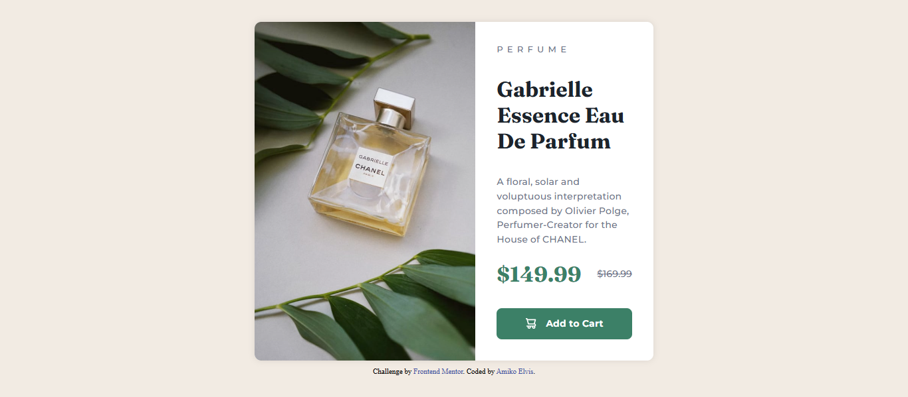

# Frontend Mentor - Product preview card component solution

This is a solution to the [Product preview card component challenge on Frontend Mentor](https://www.frontendmentor.io/challenges/product-preview-card-component-GO7UmttRfa). Frontend Mentor challenges help you improve your coding skills by building realistic projects.

## Table of contents

- [Overview](#overview)
  - [The challenge](#the-challenge)
  - [Screenshot](#screenshot)
  - [Links](#links)
- [My process](#my-process)
  - [Built with](#built-with)
  - [What I learned](#what-i-learned)
  - [Continued development](#continued-development)
  - [Useful resources](#useful-resources)
- [Author](#author)
- [Acknowledgments](#acknowledgments)

## Overview

### The challenge

Users should be able to:

- View the optimal layout depending on their device's screen size
- See hover and focus states for interactive elements

### Screenshot



### Links

- Solution URL: [Live Solution](https://your-solution-url.com)
- Live Site URL: [Live Site](https://your-live-site-url.com)

## My process

### Built with

- Semantic HTML5 markup (using <picture>, <section>, etc.)
- Flexbox (for layout and button alignment)
- Mobile-first workflow
- BEM methodology (for structured class naming)

### What I learned

This project deepened my understanding of responsive design. Here are some highlights:

- Responsive Images: Using <picture> to switch between mobile and desktop images:

```html
<picture class="product-card__image">
  <source
    media="(min-width: 700px)"
    srcset="./images/image-product-desktop.jpg"
  />
  
</picture>
```

### Continued development

I want to explore:

- CSS Grid for more complex layouts.
- Accessibility improvements (e.g., focus states with outline).
- Logical properties (like block-size) for broader language support.

### Useful resources

- [Example resource 1](https://web.dev/learn/design/responsive-images) - This helped me understand responsiveness of images.
- [Example resource 2](https://web.dev/learn/design/picture-element) - This is an amazing article on pictures.

## Author

- Website - [Amiko Elvis](https://www.your-site.com)
- Frontend Mentor - [@amikoelvis](https://www.frontendmentor.io/profile/amikoelvis)
- Twitter - [@Elvis Amiko](https://www.twitter.com/ElvisAmiko)

## Acknowledgments

Thank you Frontend Mentor for this challenge
